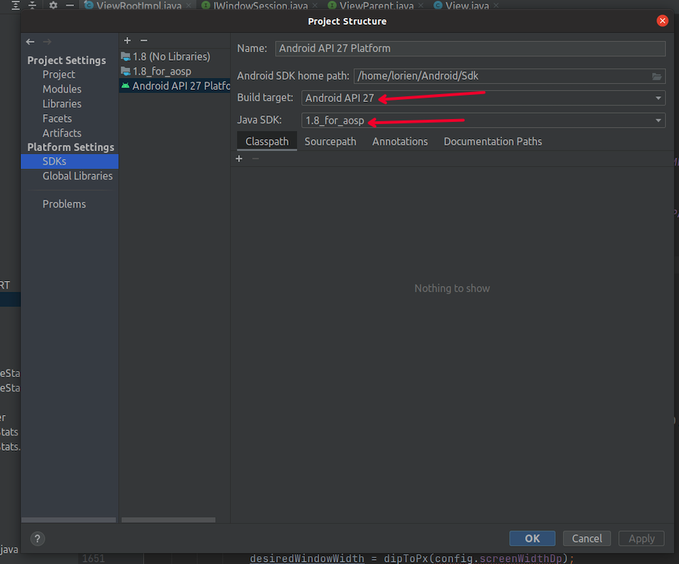
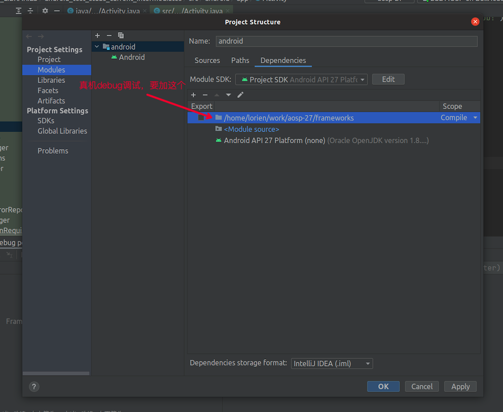
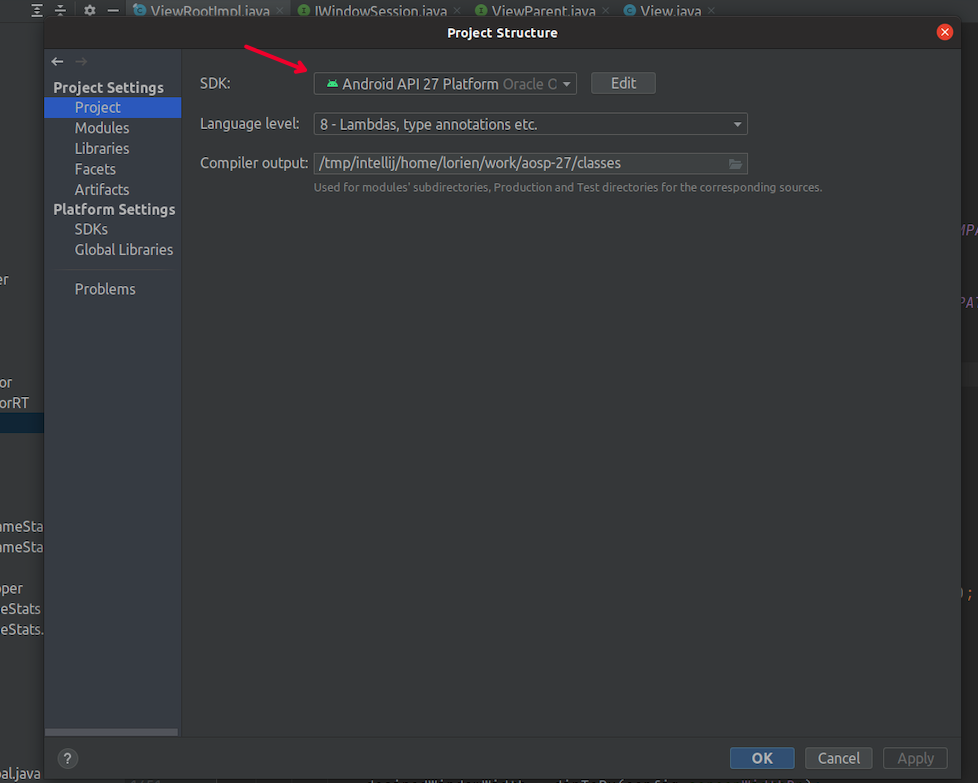
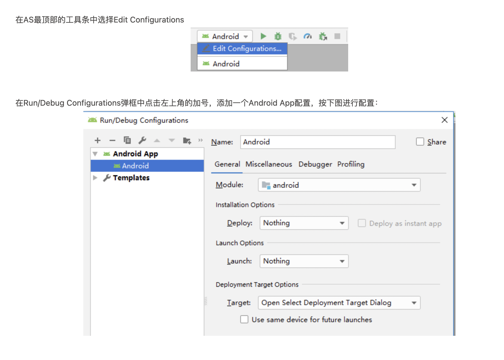

# aosp 编译、调试、刷写真机（nexus 5x）

# 一、安装repo
```bash
mkdir ~/bin
PATH=~/bin:$PATH
curl https://storage.googleapis.com/git-repo-downloads/repo > ~/bin/repo
chmod a+x ~/bin/repo
```

# 二、下载源码
```bash
mkdir aosp
cd aosp
```

### 初始化仓库
```bash
repo init -u https://aosp.tuna.tsinghua.edu.cn/platform/manifest -b android-10.0.0_r33
```
#### aosp代号、标记、build号
[https://source.android.com/docs/setup/about/build-numbers](https://source.android.com/docs/setup/about/build-numbers)

#### 同步源码
```bash
repo sync
```

删除git缓存目录
```bash
find . -name .git | xargs rm -rf
```

# 三、ubuntu编译aosp
安装依赖
```bash
sudo apt-get install git-core gnupg flex bison gperf build-essential zip curl zlib1g-dev gcc-multilib g++-multilib libc6-dev-i386 lib32ncurses5-dev x11proto-core-dev libx11-dev lib32z-dev ccache libgl1-mesa-dev libxml2-utils xsltproc unzip
```

```bash
source build/envsetup.sh 
lunch aosp_xxx-yyy
export LC_ALL=C
make -j4
```
如果要生成CLion工程，需要在编译前设置环境变量
```bash
export SOONG_GEN_CMAKEFILES=1
export SOONG_GEN_CMAKEFILES_DEBUG=1
```

# 四、导入AS
### 参考链接：

1. [https://blog.csdn.net/itachi85/article/details/89038386?spm=1001.2014.3001.5501](https://blog.csdn.net/itachi85/article/details/89038386?spm=1001.2014.3001.5501)
2. [https://www.jianshu.com/p/2ba5d6bd461e](https://www.jianshu.com/p/2ba5d6bd461e)

### 生成android.ipr android.iml
```bash
source build/envsetup.sh 
lunch aosp_xxx-yyy
mmm development/tools/idegen/

sudo development/tools/idegen/idegen.sh
```

### 增加exclude目录
```bash
<excludeFolder url="file://$MODULE_DIR$/bionic" />
<excludeFolder url="file://$MODULE_DIR$/bootable" />
<excludeFolder url="file://$MODULE_DIR$/build" />
<excludeFolder url="file://$MODULE_DIR$/cts" />
<excludeFolder url="file://$MODULE_DIR$/dalvik" />
<excludeFolder url="file://$MODULE_DIR$/developers" />
<excludeFolder url="file://$MODULE_DIR$/development" />
<excludeFolder url="file://$MODULE_DIR$/device" />
<excludeFolder url="file://$MODULE_DIR$/docs" />
<excludeFolder url="file://$MODULE_DIR$/external" />
<excludeFolder url="file://$MODULE_DIR$/hardware" />
<excludeFolder url="file://$MODULE_DIR$/kernel" />
<excludeFolder url="file://$MODULE_DIR$/out" />
<excludeFolder url="file://$MODULE_DIR$/pdk" />
<excludeFolder url="file://$MODULE_DIR$/platform_testing" />
<excludeFolder url="file://$MODULE_DIR$/prebuilts" />
<excludeFolder url="file://$MODULE_DIR$/sdk" />
<excludeFolder url="file://$MODULE_DIR$/system" />
<excludeFolder url="file://$MODULE_DIR$/test" />
<excludeFolder url="file://$MODULE_DIR$/toolchain" />
<excludeFolder url="file://$MODULE_DIR$/tools" />
<excludeFolder url="file://$MODULE_DIR$/.repo" />
```

### 配置Android Studio SDK和JDK








### ProjectStruct设置Manifest文件路径
```bash
aosp/frameworks/base/core/res/AndroidManifest.xml
```

### debug断点调试


# 五、CLion导入多工程

官方参考：[https://android.googlesource.com/platform/build/soong/+/refs/heads/master/docs/clion.md](https://android.googlesource.com/platform/build/soong/+/refs/heads/master/docs/clion.md)

#### 安装CLion
ubuntu安装CLion破解版：[https://www.quanxiaoha.com/idea-pojie/idea-reset-30-day.html](https://www.quanxiaoha.com/idea-pojie/idea-reset-30-day.html)

**【备注】破解zip包在 res/ 目录下**

#### out/development/ide/clion目录下创建CMakeLists.txt
```bash
cmake_minimum_required(VERSION 3.6)
project(aosp-29)

add_subdirectory(frameworks/av/media/libmediaplayerservice/libmediaplayerservice-arm-android)
add_subdirectory(frameworks/av/media/mediaserver/mediaserver-arm-android)
add_subdirectory(frameworks/av/media/libmedia/libmedia-arm-android)

add_subdirectory(frameworks/av/media/libaudioclient/libaudiopolicy-arm-android)
add_subdirectory(frameworks/av/media/libaudioclient/libaudioclient-arm-android)

add_subdirectory(frameworks/av/media/libaaudio/src/libaaudio-arm-android)

add_subdirectory(frameworks/av/media/libaudiohal/impl/libaudiohal@5.0-arm-android)
add_subdirectory(frameworks/av/media/libaudiohal/libaudiohal-arm-android)
add_subdirectory(frameworks/av/media/libaudiohal/libaudiohal_deathhandler-arm-android)

add_subdirectory(frameworks/av/media/libaudioprocessing/audio-resampler/libaudio-resampler-arm-android)
add_subdirectory(frameworks/av/media/libaudioprocessing/libaudioprocessing-arm-android)
add_subdirectory(frameworks/av/media/libaudioprocessing/libaudioprocessing_arm-arm-android)

add_subdirectory(frameworks/av/services/audioflinger/libaudioflinger-arm-android)
add_subdirectory(frameworks/av/services/audiopolicy/common/managerdefinitions/libaudiopolicycomponents-arm-android)
add_subdirectory(frameworks/av/services/audiopolicy/engine/common/libaudiopolicyengine_common-arm-android)
add_subdirectory(frameworks/av/services/audiopolicy/engine/config/libaudiopolicyengine_config-arm-android)
add_subdirectory(frameworks/av/services/audiopolicy/engineconfigurable/libaudiopolicyengineconfigurable-arm-android)
add_subdirectory(frameworks/av/services/audiopolicy/engineconfigurable/parameter-framework/plugin/libpolicy-subsystem-arm-android)
add_subdirectory(frameworks/av/services/audiopolicy/engineconfigurable/wrapper/libaudiopolicyengineconfigurable_pfwwrapper-arm-android)
add_subdirectory(frameworks/av/services/audiopolicy/enginedefault/libaudiopolicyenginedefault-arm-android)

# audio tests
add_subdirectory(frameworks/base/media/tests/audiotests/shared_mem_test-arm-android)
add_subdirectory(frameworks/base/core/jni/libandroid_runtime-arm-android)

# androidmk mk -> bp
add_subdirectory(frameworks/av/services/audiopolicy/manager/libaudiopolicymanager-arm-android)
add_subdirectory(frameworks/av/services/audiopolicy/managerdefault/libaudiopolicymanagerdefault-arm-android)
add_subdirectory(frameworks/av/services/audiopolicy/service/libaudiopolicyservice-arm-android)
add_subdirectory(frameworks/av/media/audioserver/audioserver-arm-android)

# binder
add_subdirectory(frameworks/native/libs/binder/libbinder-arm-android)
add_subdirectory(frameworks/native/cmds/servicemanager/bctest-arm-android)
add_subdirectory(frameworks/native/cmds/servicemanager/servicemanager-arm-android)
add_subdirectory(system/core/libutils/libutils-arm-android)

add_subdirectory(frameworks/native)

add_subdirectory(hardware/libhardware/libhardware-arm-android)
add_subdirectory(hardware/libhardware/modules/vibrator/vibrator.default-arm-android)
#add_subdirectory(hardware/interfaces/light/2.0/android.hardware.light@2.0-adapter-arm-android)
#add_subdirectory(hardware/interfaces/light/2.0/android.hardware.light@2.0-adapter-helper-arm-android)
add_subdirectory(hardware/interfaces/light/2.0/android.hardware.light@2.0-arm-android)
#add_subdirectory(hardware/interfaces/light/2.0/android.hardware.light@2.0-vts.driver-arm-android)
#add_subdirectory(hardware/interfaces/light/2.0/android.hardware.light@2.0-vts.profiler-arm-android)
add_subdirectory(hardware/interfaces/light/2.0/default/android.hardware.light@2.0-impl-arm-android)
add_subdirectory(hardware/interfaces/light/2.0/default/android.hardware.light@2.0-service-arm-android)
add_subdirectory(hardware/interfaces/light/2.0/default/android.hardware.light@2.0-service-lazy-arm-android)

add_subdirectory(hardware/libhardware_legacy/audio/libaudiohw_legacy-arm-android)
add_subdirectory(hardware/libhardware/modules/audio/audio.primary.default-arm-android)
add_subdirectory(hardware/libhardware/modules/audio/audio.stub.default-arm-android)
add_subdirectory(hardware/libhardware/modules/audio/audio_policy.stub-arm-android)
add_subdirectory(hardware/libhardware/modules/audio_remote_submix/audio.r_submix.default-arm-android)

# system_server
add_subdirectory(frameworks/base/services/core/jni/libservices.core-arm-android)

```

使用CLion以project形式打开CMakeLists.txt

#### CLion index工程时可能会报错：
```bash
no such file or directory: 'external/compiler-rt/lib/cfi/cfi_blacklist.txt'
```

#### 解决：
在CMakeLists.txt中找到这个文件，添加${ANDROID_ROOT}，改成绝对路径:
```bash
set(CMAKE_CXX_FLAGS "${CMAKE_CXX_FLAGS} -fsanitize-blacklist=${ANDROID_ROOT}/external/compiler-rt/lib/cfi/cfi_blacklist.txt")
```

# 六、CLion 调试native代码
### Log + 断点

参考：[https://mp.weixin.qq.com/s/ZLnqsIGu7zvrW8s5kHVpdA](https://mp.weixin.qq.com/s/ZLnqsIGu7zvrW8s5kHVpdA)

### 调试时变量显示 potimized out
这是因为clang编译时默认会进行优化，可以在Android.dp的cppflags中加入-O0禁止优化，然后重新编译m -j8，重启模拟器再次执行调试就可以了。

# 七、刷机（Nexus 5x）
### 参考官方链接
[https://source.android.com/docs/setup/build/running?hl=zh-cn](https://source.android.com/docs/setup/build/running?hl=zh-cn)

### 下载硬件驱动
[https://developers.google.com/android/drivers?hl=en#bullheadopm7.181205.001](https://developers.google.com/android/drivers?hl=en#bullheadopm7.181205.001)

下载后执行shell文件，将生成驱动文件copy到aosp根目录。重新执行编译aosp，注意lunch目标：
```bash
lunch aosp_bullhead-userdebug
```

### 编译结束后，开始烧写img文件
```bash
# 产物环境变量
export ANDROID_PRODUCT_OUT=/home/lorien/work/aosp-27/out/target/product/bullhead

# 解锁oem（15年以前和15年以后的手机有区别）
fastboot flashing unlock

# 进入bootloader模式
adb reboot bootloader

# 烧写img映像文件
fastboot flashall -w
```

### 常见问题
1. fastboot devices 提示没权限
```bash
which fastboot

sudo chown root:root fastboot

sudo chmode +s fastboot
```

2. 系统烧写成功后，wifi连接成功但是没有网络
```bash
删除变量：（删除以后默认启用）
adb shell settings delete global captive_portal_mode
关闭检测：
adb shell settings put global captive_portal_mode 0
查看当前状态：
adb shell settings get global captive_portal_mode

删除（删除默认用HTTPS）
adb shell settings delete global captive_portal_https_url
adb shell settings delete global captive_portal_http_url
分别修改两个地址
adb shell settings put global captive_portal_http_url http://captive.v2ex.co/generate_204
adb shell settings put global captive_portal_https_url https://captive.v2ex.co/generate_204
```

